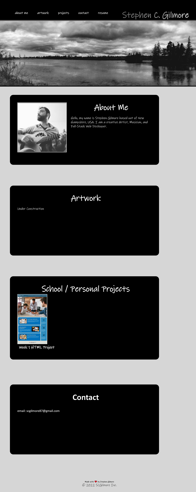

# 02-Portfolio
// Stephen C. Gilmore //

## Objective 

Create a portfolio web application from scratch that shows developer's work examples to potential employers

Criteria: 

* When portfolio is loaded it presents developer's name
* Presents recent photo or avatar of developer
* Contains links to sections of about them, their work, and contact information
* When the links are clicked, it scrolls down to the corresponding section
* The developer's first application image should be larger than the others
* When clicking into images of applications it then deploys that application
* When viewer resizes the page or view of the site on different screen sizes, 
they are presented with responsive layout that adapts to their viewport. 

## Work Done 

*still under construction *

 

## Application Screenshot & Deployment

Repository uploaded to [GitHub](
https://github.com/scgilmore87/02-Portfolio)

View The final deployed project [Website Here](https://scgilmore87.github.io/02-Portfolio/)

&copy; Stephen C. Gilmore 2022